## Deployment in AWS EC2


1. Login to AWS Management Console as root user [Click Here](https://signin.aws.amazon.com/signin?client_id=arn%3Aaws%3Asignin%3A%3A%3Aconsole%2Fcanvas&redirect_uri=https%3A%2F%2Fconsole.aws.amazon.com%2Fconsole%2Fhome%3FhashArgs%3D%2523%26isauthcode%3Dtrue%26nc2%3Dh_si%26src%3Dheader-signin%26state%3DhashArgsFromTB_eu-north-1_582b15ac24e32403&page=resolve&code_challenge=BuLK7FZTyPlT-uyFVlnxZEf6OB65aY8ksawowF3_G5E&code_challenge_method=SHA-256&backwards_compatible=true)


2. Search for EC2

<p align="left">
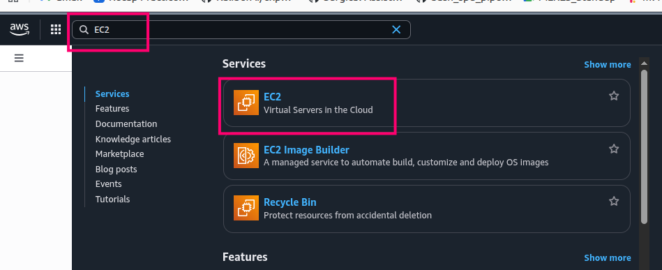
</p>

3. Click on Launch EC2 instance

<p align="left">
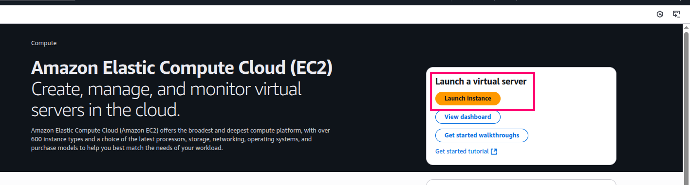
</p>

4. Write Name and Select Ubuntu OS

<p align="left">
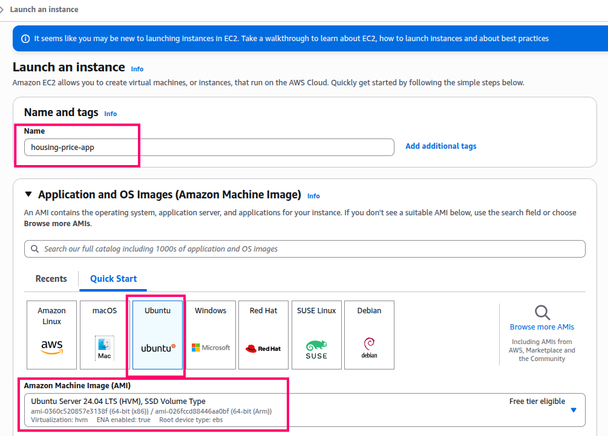
</p>

5. Select Architecture, Instance-type and Key-pair

<p align="left">
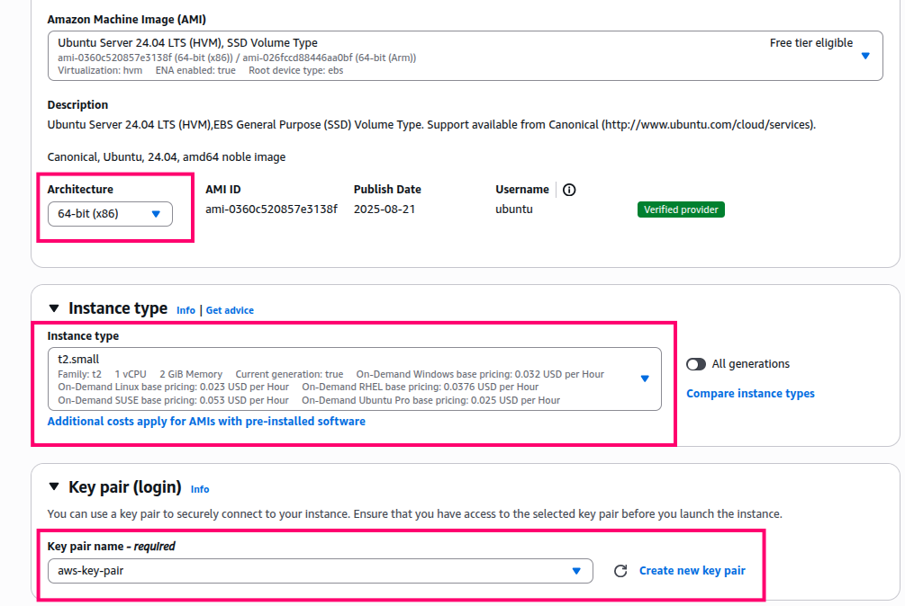
</p>

6. Configure firewall settings and storage

<p align="left">
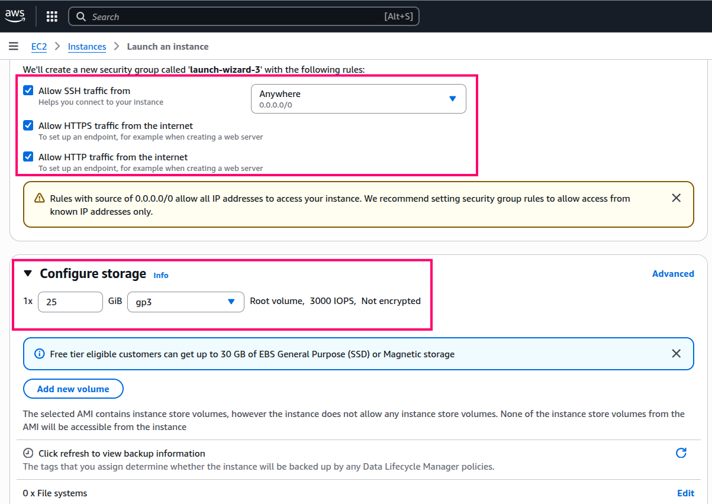
</p>

7. Lanuch instance

<p align="left">
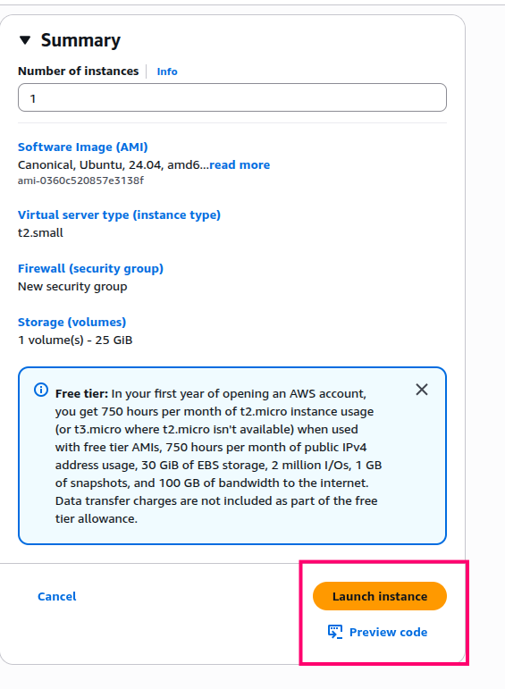
</p>

8. Instance is created

<p align="left">
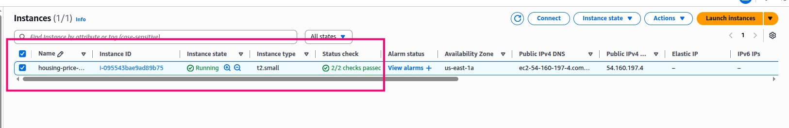
</p>

9. Navigate to **Security-> Security Groups**

<p align="left">
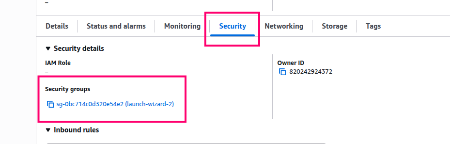
</p>

10. Click on **Edit inbound rules**

<p align="left">
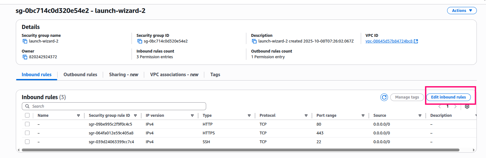
</p>

11. Expose port **8501** for streamlit and **8000** for fastAPI

<p align="left">
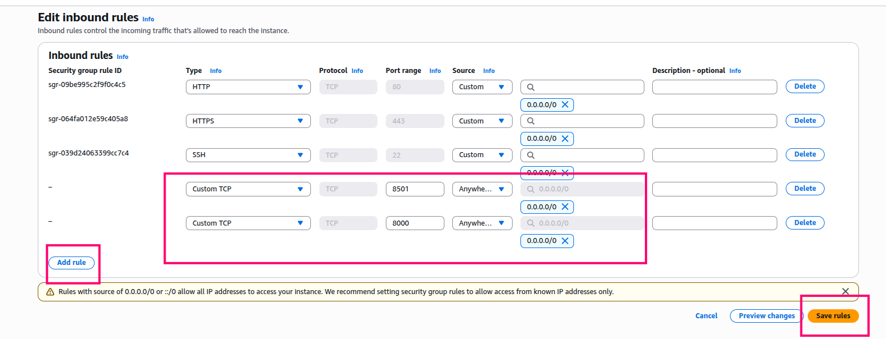
</p>


12. Go to **instances** and connect to **instance**

<p align="left">
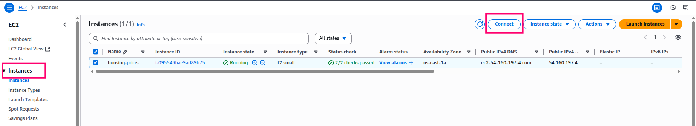
</p>

13. Connect using Public IP

<p align="left">
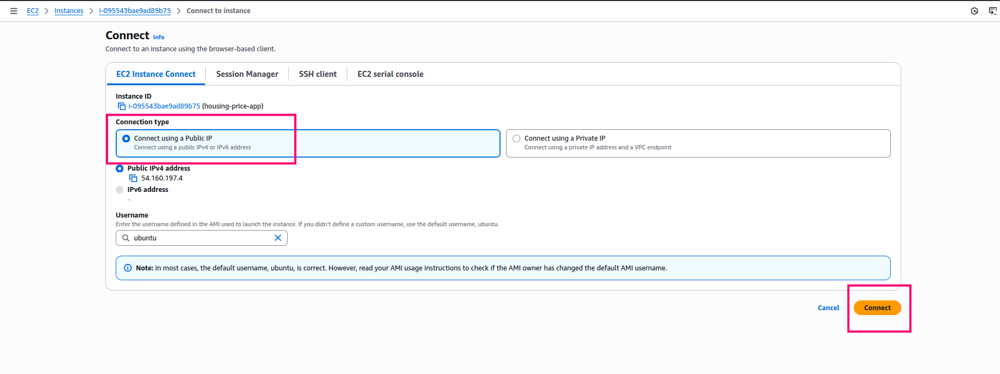
</p>

14. EC2 instance is connected

<p align="left">
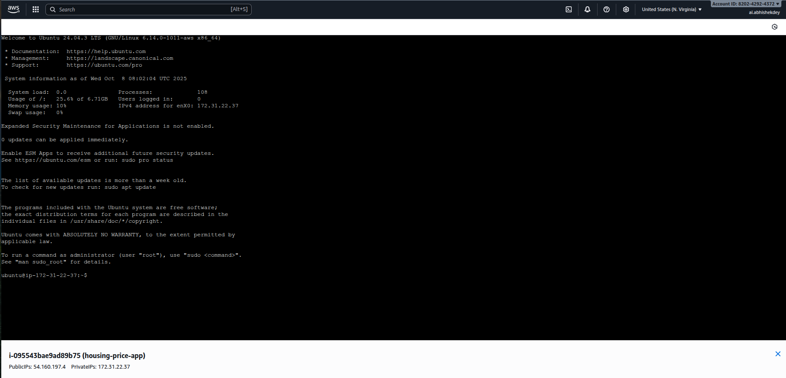
</p>


### Run the below commands


* Update and upgrade

```

sudo apt-get update -y

sudo apt-get upgrade -y

```

* Install docker

```
curl -fsSL https://get.docker.com -o get-docker.sh

sudo sh get-docker.sh

sudo usermod -aG docker ubuntu

newgrp docker

```

* Docker login using cli

```

docker login -u <username>

```

* Pull docker image from docker hub

```
docker pull abhishekdey001/housing-price-app:latest

```

* Run Docker container

```

docker run -d -p 8501:8501 -p 8000:8000 abhishekdey001/housing-price-app:latest

```

* Go to instances -> copy public ip -> paste public ip in browser with 8501 port

<p align="left">
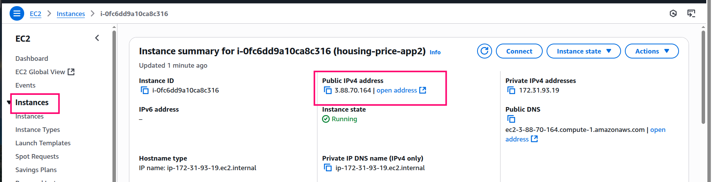
</p>


```
3.88.70.164:8501

```

* The app should be up and running in the browser

* To stop the app, stop the docker container

```
docker stop <container-id>

```

<p align="left">
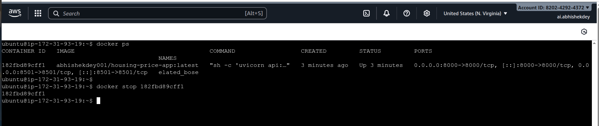
</p>

* Make sure to **stop** and **terminate** after use

<p align="left">
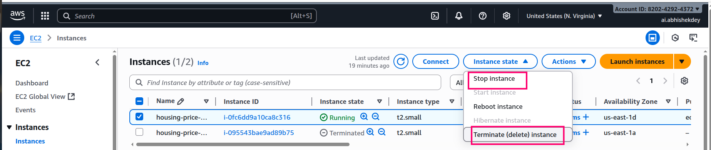
</p>

## References:

* https://www.youtube.com/watch?v=DflWqmppOAg

* https://github.com/entbappy/Streamlit-app-Docker-Image

