## Deployment in AWS Lightsail

1. Login to AWS Management Console as root user [Click Here](https://signin.aws.amazon.com/signin?client_id=arn%3Aaws%3Asignin%3A%3A%3Aconsole%2Fcanvas&redirect_uri=https%3A%2F%2Fconsole.aws.amazon.com%2Fconsole%2Fhome%3FhashArgs%3D%2523%26isauthcode%3Dtrue%26nc2%3Dh_si%26src%3Dheader-signin%26state%3DhashArgsFromTB_eu-north-1_582b15ac24e32403&page=resolve&code_challenge=BuLK7FZTyPlT-uyFVlnxZEf6OB65aY8ksawowF3_G5E&code_challenge_method=SHA-256&backwards_compatible=true)

2. Search for **Lightsail**

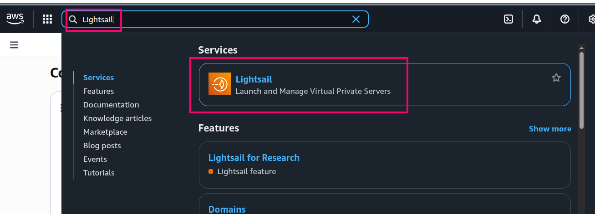

3. Go to instances and click on **Create instance**

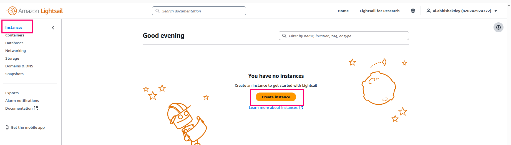

4. Select Linux/Unix platform and Ubuntu 24.04 LTS OS

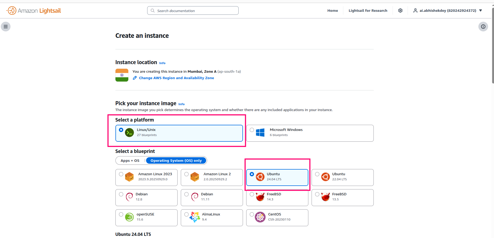

5. Create SSH Key-pair, select a 2 GB memory system and create an instance

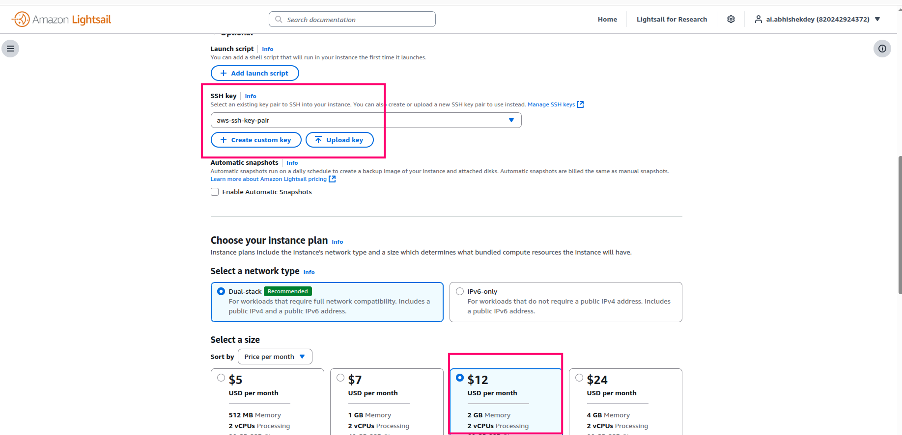

6. Ubuntu instance is created

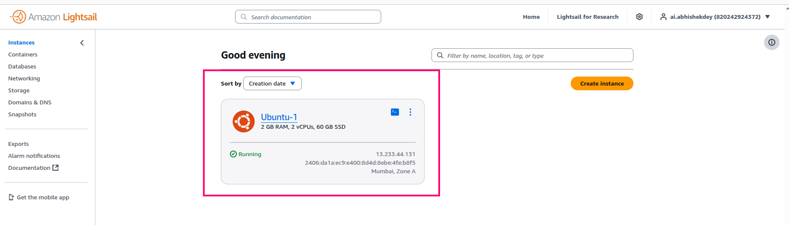

7. Next go to **containers** and click on **create container service**

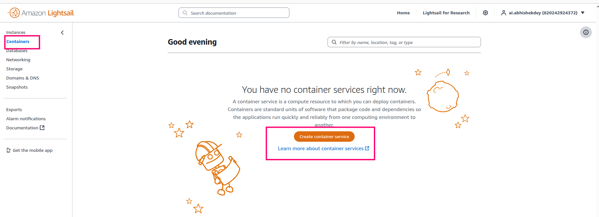

8. Choose **container service capacity**

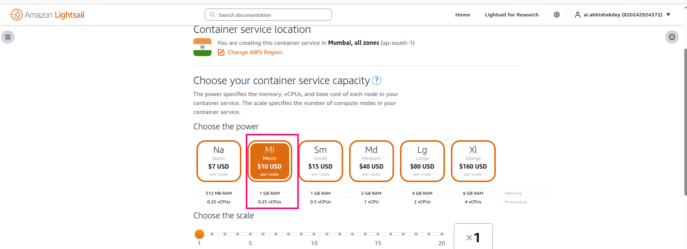

9. Setup deployment

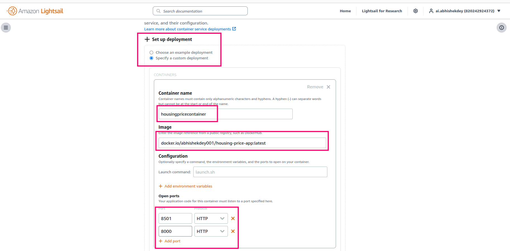

10. Setup public end point details

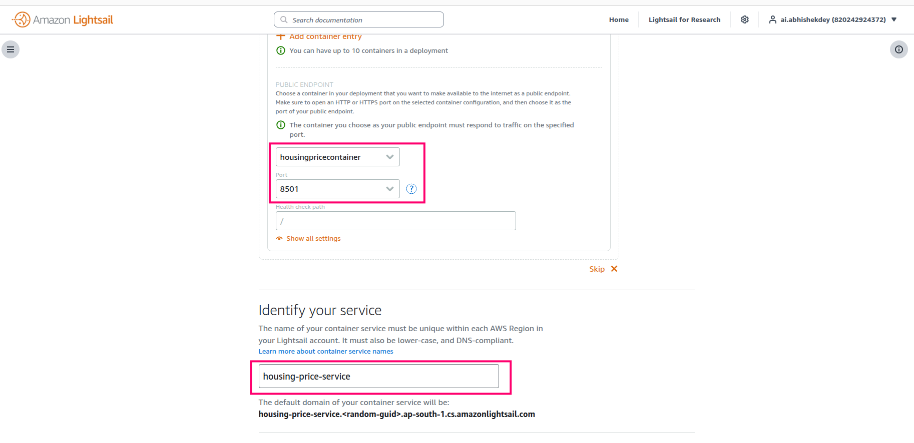

11. Create container service

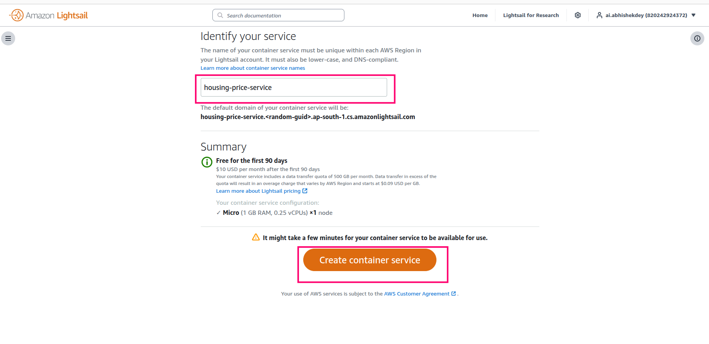

12. Container service is **activated**. Click on the **Public domain** link to see the app running

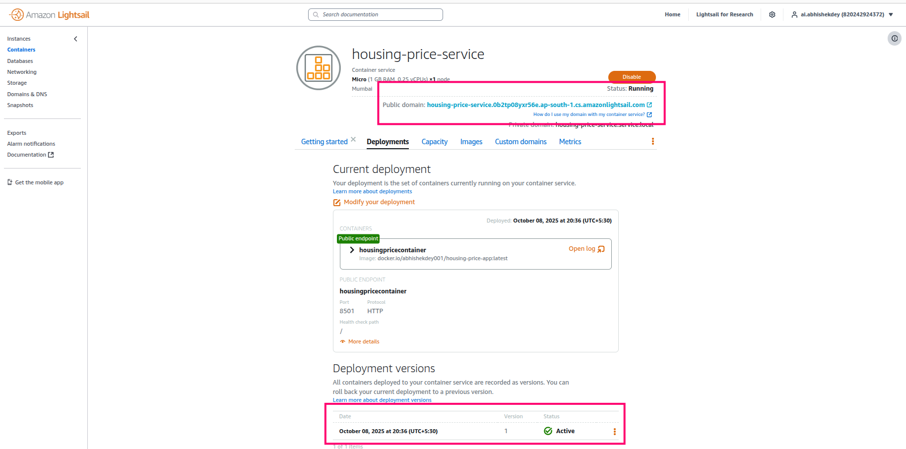

13. To stop the container service, click on **Delete**

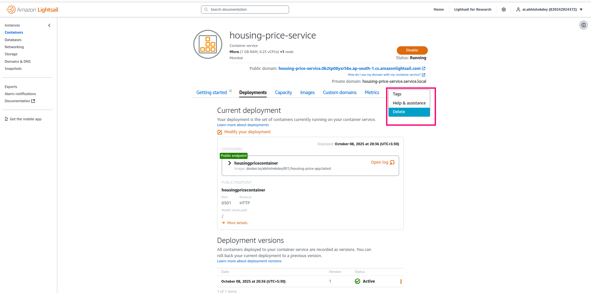

14. Don't forget to **Stop** and **Delete** the instance

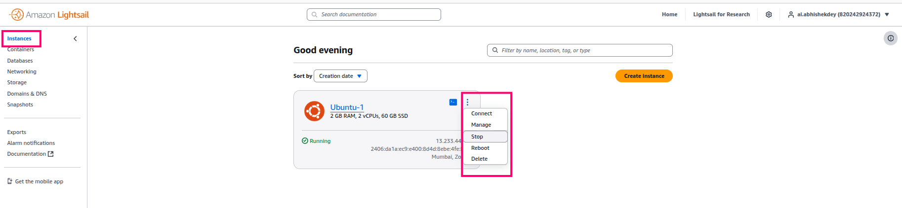

