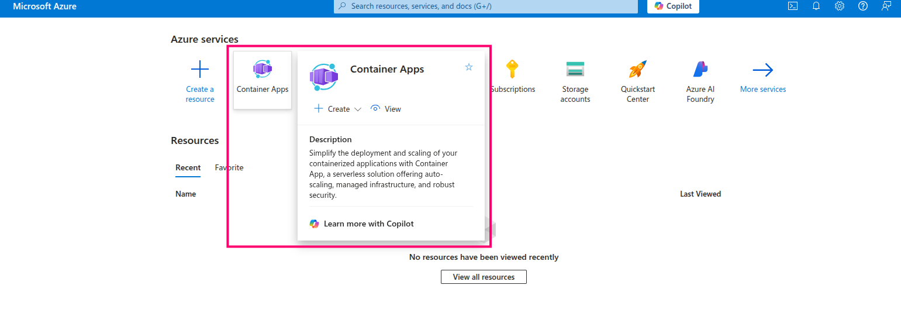
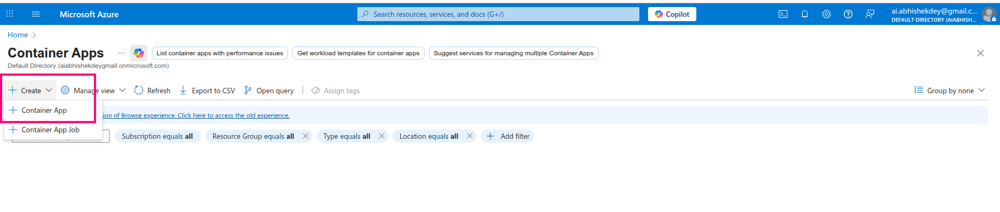
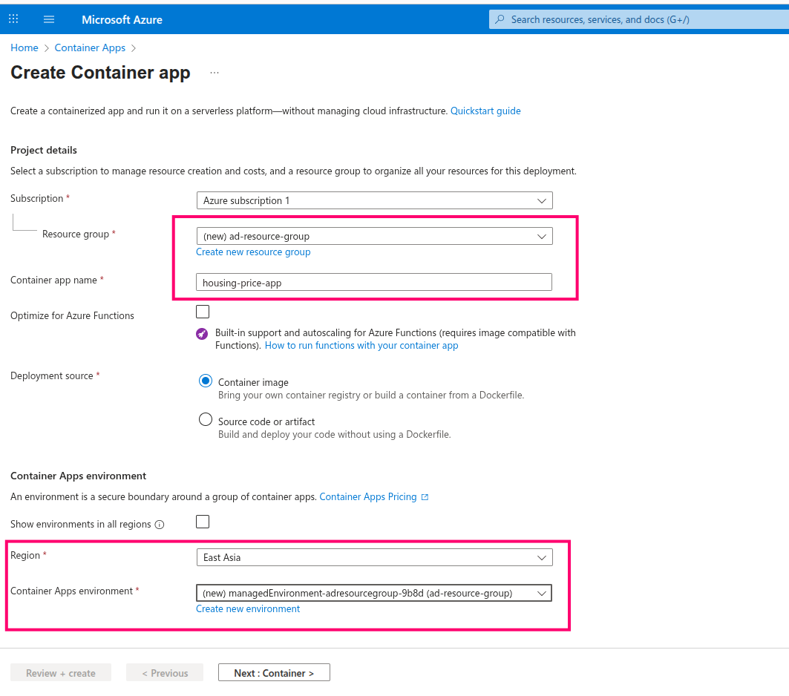
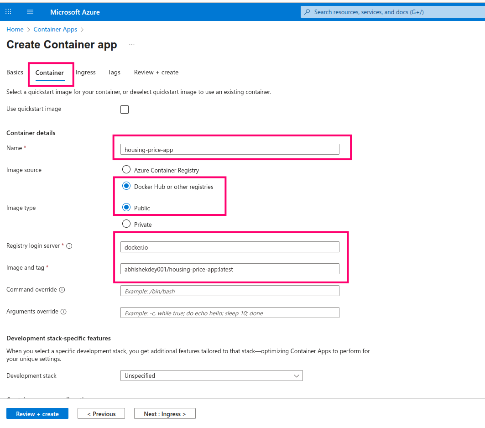
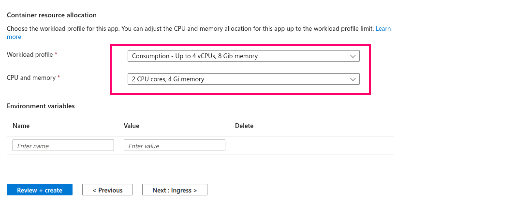
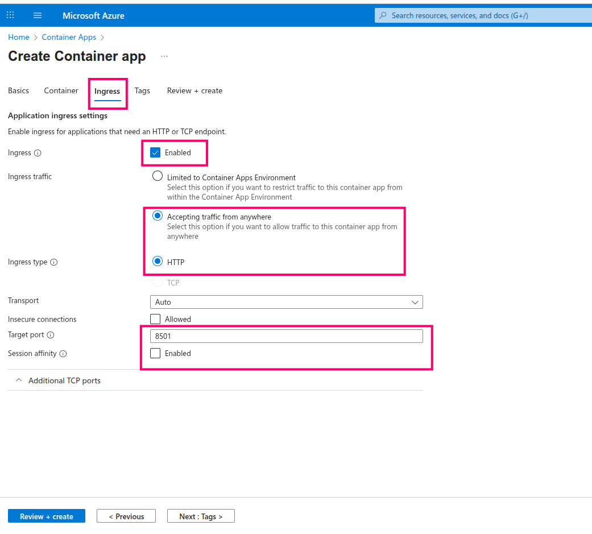
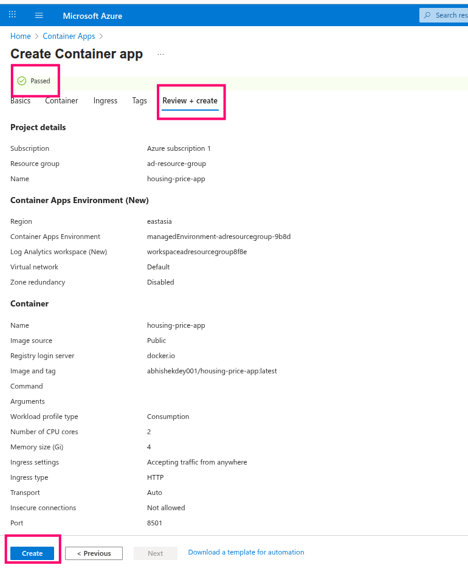
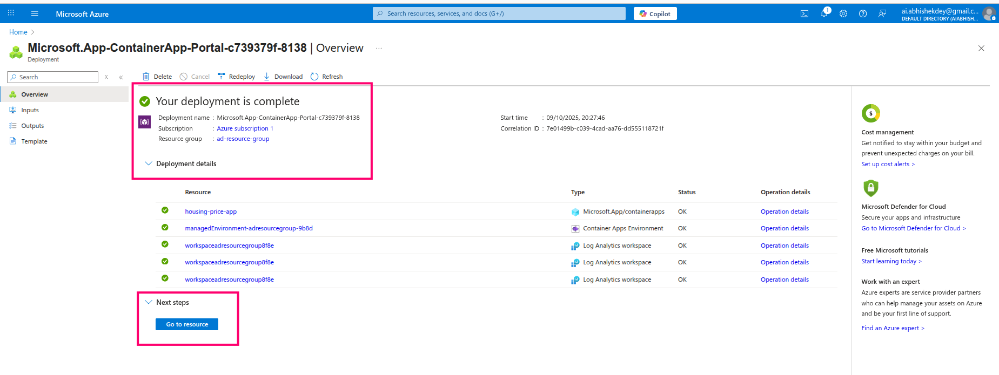
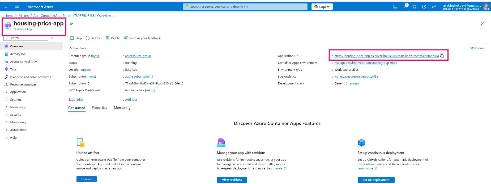
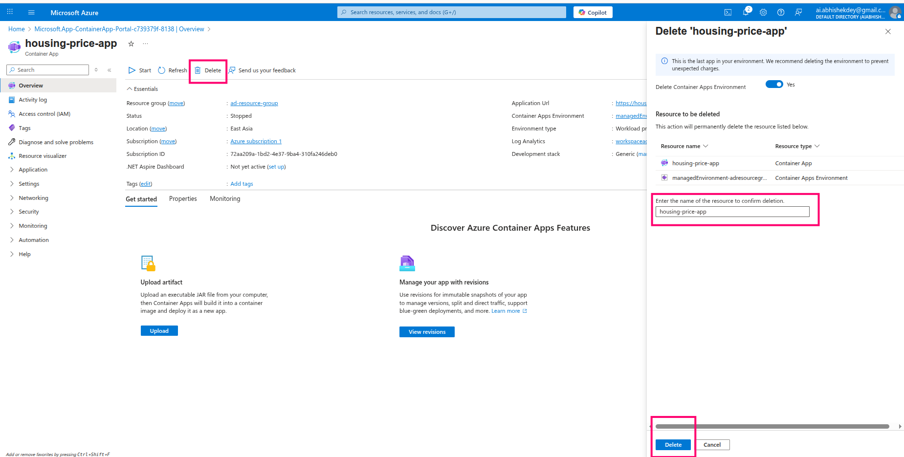

## Deployment in Azure Container Apps

1. Login to your [Microsoft Azure Portal](https://azure.microsoft.com/en-us/get-started/azure-portal) and Click on **Container Apps** in home page

2. Create **Container App**

3. Fill up the details as below

4. Navigate to **Container** and fill up the details as below

5. Choose workload profile as below

6. Navigate to **Ingress** and fill up the details as below

7. Next go to **Review + Create** and click on **create**

8. Container deployment is completed

9. Launch the app from the **Application Url**

10. Don't forget to **Stop** and **Delete** the container app after use

