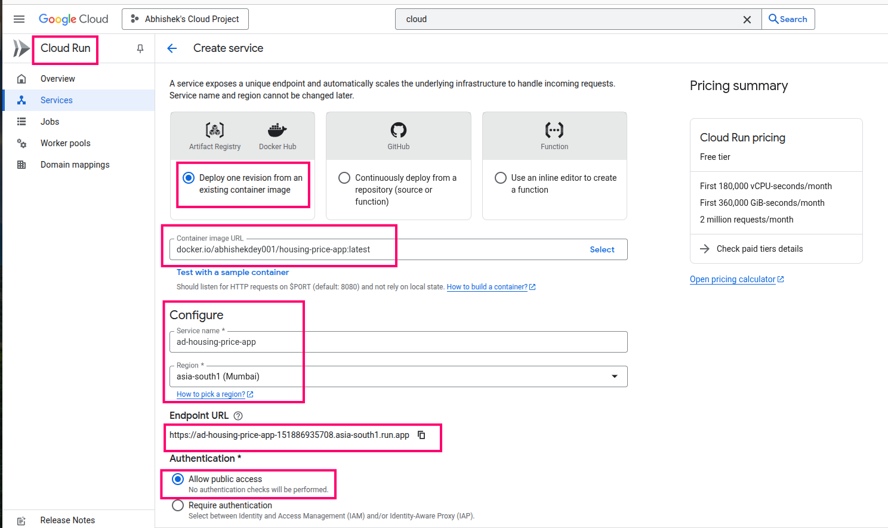
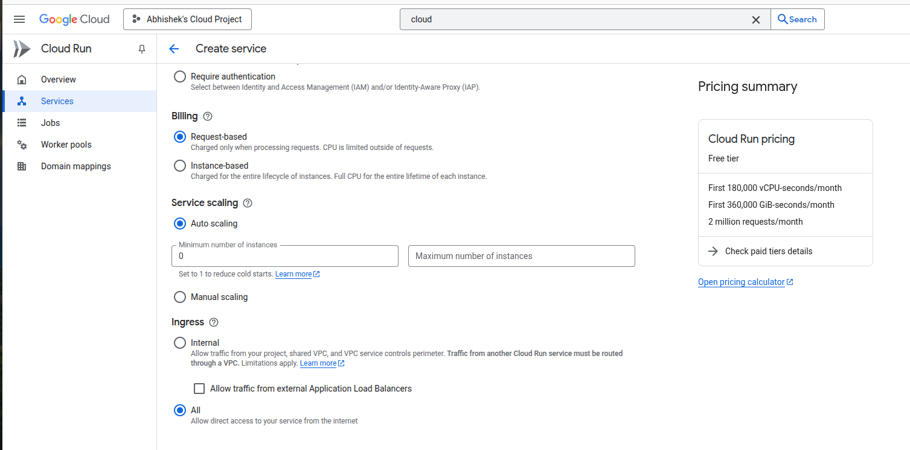
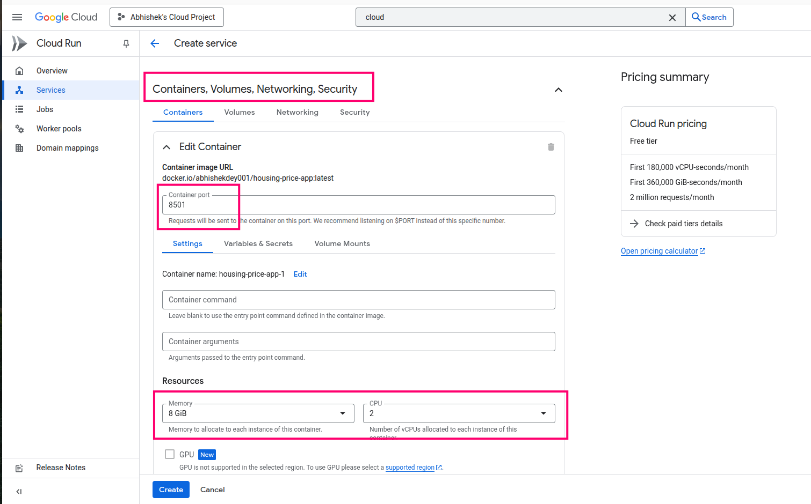
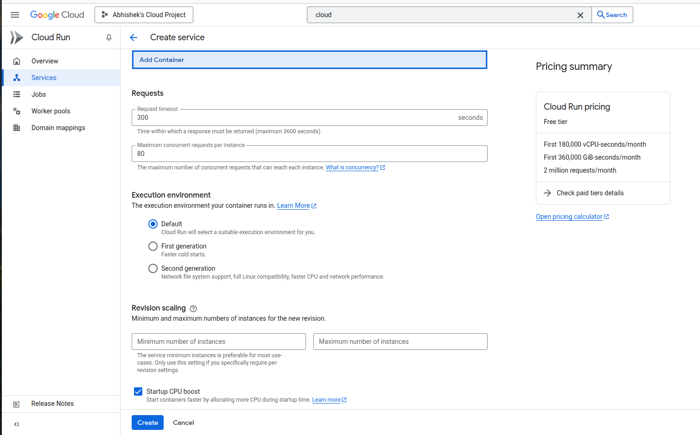
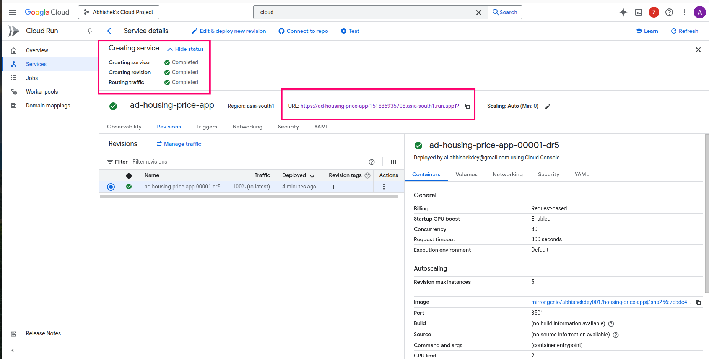
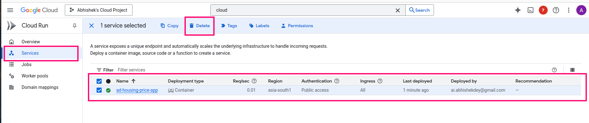

## Deployment in Google Cloud Run

1. Login to your [Google Cloud Console](https://console.cloud.google.com/) and search for **Cloud Run**. Fill up the details as below

2. Choose **Billing** option

3. Edit **Container** details as below

4. Keep default as below

5. Deployment is completed. Access the app by clicking the **URL**

6. **Delete** the app after use

